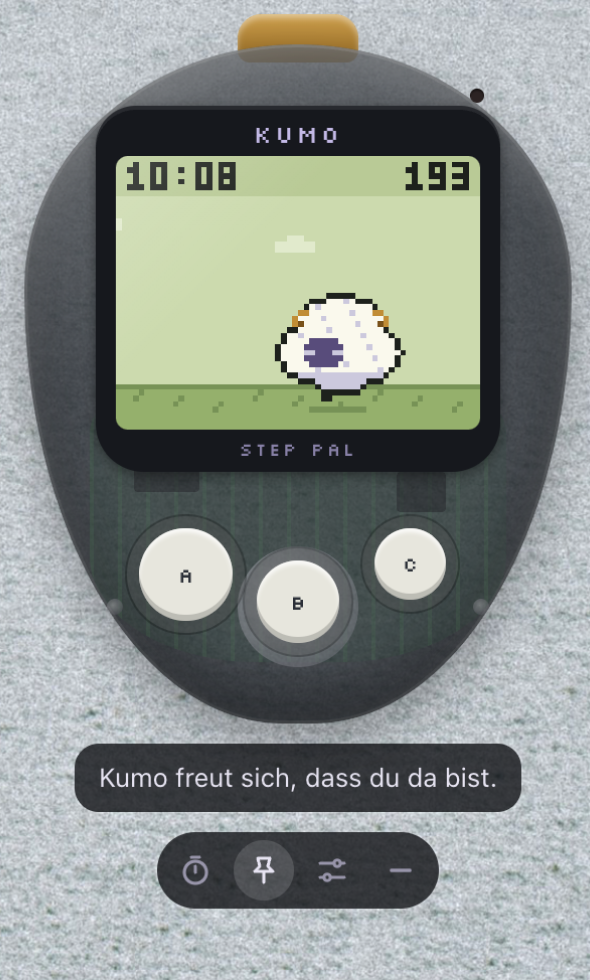
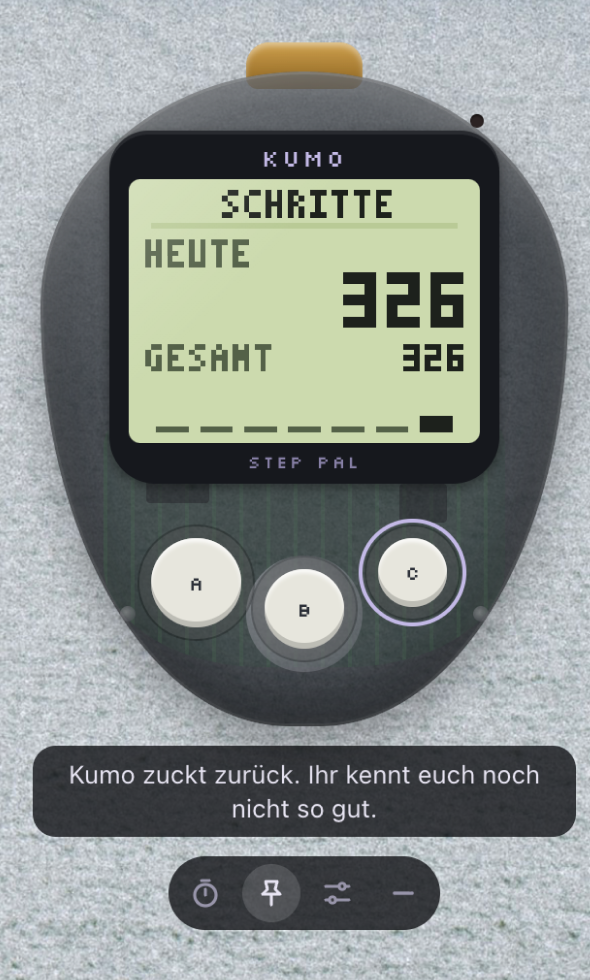
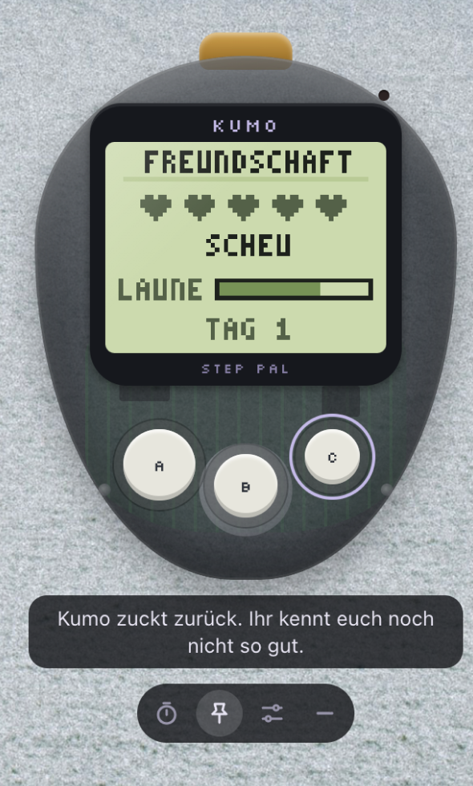
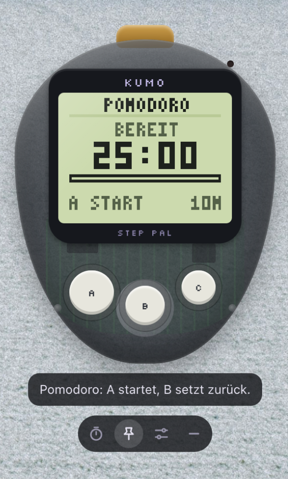

# Kumo – Desktop-Begleiter

Ein kleines Wolkenschaf, das über deinem Desktop schwebt. Jede Mausbewegung zählt als Schritt, dazu gibt es einen Pomodoro-Timer und eine Pausen-Erinnerung.



*Dein Desktop-Begleiter – zählt Mausbewegungen als Schritte*

## 📥 Download

**[→ Releases herunterladen](https://github.com/simonbasler/kumo-desktop/releases)**

- **Apple Silicon (M1/M2/M3)**: `Kumo-1.0.0-arm64.dmg`
- **Intel Macs**: `Kumo-1.0.0.dmg`

**Installation**: DMG öffnen → Kumo in Programme-Ordner ziehen → Beim ersten Start: Rechtsklick → Öffnen

## Screenshots

<table>
<tr>
<td width="25%"><br><b>Hauptansicht</b></td>
<td width="25%"><br><b>Schritte</b></td>
<td width="25%"><br><b>Beziehung</b></td>
<td width="25%"><br><b>Pomodoro</b></td>
</tr>
</table>

*Einstellungen-Screenshot folgt noch*

## 🎮 Steuerung & Bedienung

### Tastatur-Steuerung

**Hardware-Tasten (immer aktiv):**
| Taste | Aktion |
|-------|--------|
| **A** | Streicheln / Pomodoro starten oder pausieren |
| **B** | Kumo rufen / Pomodoro zurücksetzen |
| **C** | Ansicht wechseln (zyklisch) |

**Software-Tasten (nur wenn Fenster aktiv):**
| Taste | Entspricht |
|-------|------------|
| **A** | Hardware-Taste A |
| **S** | Hardware-Taste B |
| **D** | Hardware-Taste C |

### Ansichten-Zyklus (Taste C)

Drücke **C** um durch diese Ansichten zu wechseln:
1. **Kumo** - Hauptansicht mit dem Schaf
2. **Schritte** - Schrittzähler-Ansicht
3. **Freundschaft** - Freundschafts-Level
4. **Pomodoro** - Pomodoro-Timer
5. → zurück zu Kumo

### Kontrollleiste (unten im Fenster)

Von links nach rechts:

| Position | Button | Funktion |
|----------|--------|----------|
| 1 | **Pomodoro** (Uhr) | Wechselt direkt zur Pomodoro-Ansicht |
| 2 | **Pin** (Stecknadel) | Fenster immer im Vordergrund halten |
| 3 | **Einstellungen** (Regler) | Öffnet Einstellungs-Dialog |
| 4 | **Verstecken** (Minus) | Blendet Fenster aus |

### Fenster bewegen

- **Klicken & Ziehen**: Fenster an beliebiger Stelle greifen und verschieben
- Kumo bleibt an der Position, wo du es ablegst

### Menüleiste

Das Kumo-Symbol in der macOS-Menüleiste:
- Zeigt **Restzeit** während eines laufenden Pomodoros
- **Rechtsklick** öffnet Kontextmenü mit zusätzlichen Optionen

## 🚀 Entwicklung (Mac)

Voraussetzung: Node.js ab Version 20 (`node -v` im Terminal).

```bash
cd kumo-desktop
npm install
npm start
```

## Als echte App bauen

```bash
npm run dist
```

Danach liegt in `dist/` eine `Kumo-1.0.0-arm64.dmg` (Apple Silicon) und eine x64-Variante. Öffnen, Kumo in den Programme-Ordner ziehen, fertig. Die App ist nur ad-hoc signiert. Weil du sie selbst gebaut hast, startet sie trotzdem ohne Warnung. Gibst du sie weiter, muss der Empfänger beim ersten Start Rechtsklick → Öffnen wählen.

**Tipp:** Unter Systemeinstellungen → Allgemein → Anmeldeobjekte kannst du Kumo beim Login starten lassen.

## ⚙️ So funktioniert's

- **Schritte:** Der Hauptprozess fragt alle 40 ms die Mausposition ab (`screen.getCursorScreenPoint`). Alle 400 px Mausweg (einstellbar) gibt es einen Schritt. Sprünge über 800 px, etwa beim Wechsel des Bildschirms, werden ignoriert. Dafür braucht es keine Bedienungshilfen-Rechte.
- **Pausen-Erinnerung:** Nutzt die Leerlaufzeit des Systems, also Maus *und* Tastatur. Nach 50 Minuten Aktivität ohne 5 Minuten Ruhe gibt es eine Mitteilung. Machst du dann Pause, freut sich Kumo. Ignorierst du die Erinnerung mehrmals, sinkt seine Laune. Während ein Pomodoro läuft, übernimmt der Timer die Pausen.
- **Pomodoro:** 25 / 5 / 15 Minuten, nach 4 Runden kommt eine lange Pause. Die Pause startet automatisch, die nächste Fokus-Runde startest du selbst. Jede geschaffte Runde stärkt die Freundschaft.
- **Laune & Freundschaft:** Steigen durch Schritte, Streicheln, geschaffte Pomodoros und echte Pausen. Zu viel Streicheln nervt Kumo. Nach langer Abwesenheit schmollt es, wenn ihr euch noch nicht gut kennt. Nachts (22–6 Uhr) schläft Kumo.
- **Speicher:** Alles bleibt lokal auf deinem Mac (`~/Library/Application Support/Kumo`).

## Dateien

```
main.js          Hauptprozess: Fenster, Maus-Abfrage, Leerlauf, Menüleiste, Mitteilungen
preload.js       sichere Brücke zum Fenster
renderer/        Oberfläche: Gerät, Pixel-Engine, Pomodoro, Einstellungen
assets/          Menüleisten-Symbol
build/icon.png   App-Symbol
```

Debug-Ausgabe der Mauswege: `KUMO_DEBUG=1 npm start`
